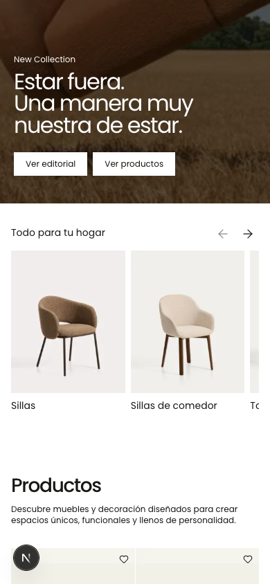
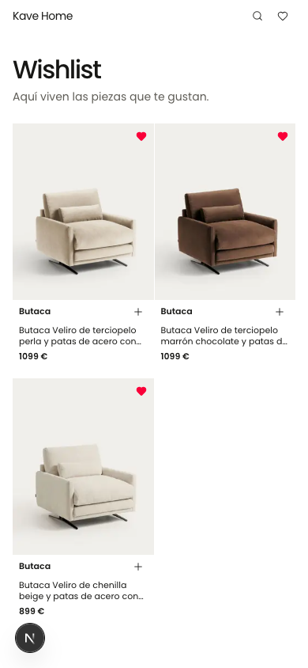
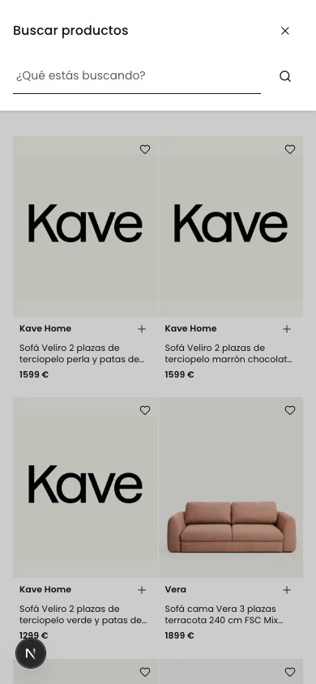
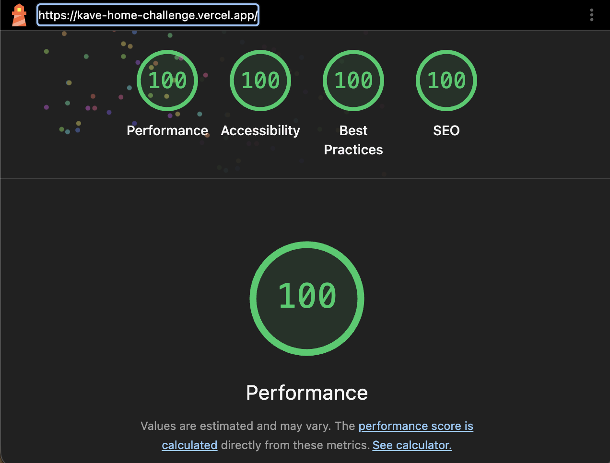
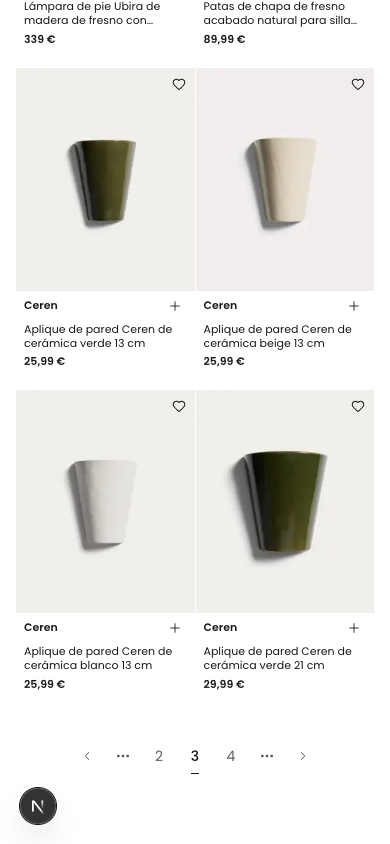

# Kave Home · Frontend Challenge

Storefront responsive construido con Next.js 16, React 19, TypeScript y Tailwind CSS 4. Consume el catálogo público de Kave Home, permite explorar productos y categorías y conserva favoritos en el navegador.

[Ver despliegue en Vercel](https://kave-home-challenge.vercel.app)

## Vista rápida

Las capturas se generaron sobre el modo local determinista incluido en el proyecto.


<table>
  <tr>
    <td width="50%">
      
    </td>
    <td width="50%">
      
    </td>
  </tr>
  <tr>
    <td width="50%">
      
    </td>
    <td width="50%">
      
    </td>
  </tr>
  <tr>
    <td colspan="2">
      
    </td>
  </tr>
</table>



## Puesta en marcha

```bash
npm ci
cp .env.example .env.local
npm run dev
```

- `npm run dev`: Next.js con snapshots locales reproducibles.
- `npm run dev:live`: integración directa con la API pública y sus errores reales.
- `npm run build && npm start`: comportamiento de producción; intenta la API real y permite activar un fallback explícito a snapshots.

Rutas disponibles: `/`, `/products`, `/products/[sku]`, `/categories`, `/categories/[slug]`, `/favorites` y `/search?q=...`.

## Funcionalidad

- Home editorial con categorías y 20 productos por página.
- Catálogo paginado mediante la URL, con canonical y normalización de páginas inválidas.
- Fichas de categoría con contenido editorial y subcategorías.
- Detalle de producto con galería, precio, disponibilidad y favorito.
- Favoritos con React Context y persistencia versionada en `localStorage`.
- Búsqueda por el endpoint público.
- Estados de carga, vacío, error, recurso inexistente e imagen no disponible.
- Diseño mobile-first, HTML semántico, navegación por teclado y metadata por ruta.

## Arquitectura

El proyecto aplica una arquitectura fractal entendida como **co-localización con promoción por reutilización**, no como una plantilla de carpetas que haya que repetir completa.

```text
src/
  app/            adaptadores finos del App Router
  features/       páginas y UI propias de cada dominio
  containers/     composiciones reutilizadas entre features
  primitives/     piezas mínimas de interfaz
  providers/      estado cliente transversal
  layouts/        composiciones globales
  page-modules/   páginas transversales de error y not-found
  services/       frontera con la API externa
  config/         entorno validado
  constants/      contratos compartidos
  utils/          funciones puras reutilizables
  test-support/   fixtures y dobles compartidos por los tests
```

Una pieza nace junto a la feature que la necesita. Sólo se promociona al ancestro común más cercano cuando aparece reutilización real:

- Home y Products usan `ProductListing`, por lo que vive en `src/containers/product-listing`. Además de componer grid y paginación, concentra la política de página que ambas rutas comparten: normalización del parámetro, total de páginas, enlaces, canonical y destino de redirección.
- Home y las dos superficies de categorías usan `CategoryList`, promovido a `src/containers/category-list`.
- `FavoriteButton` y `FavoritesProvider` son compartidos por varias rutas y viven fuera de una feature concreta.
- `Button`, `Card`, `Input` y `Skeleton` no conocen el dominio y permanecen en `primitives`.

La misma regla se aplica a los estados de carga. Un `loading.tsx` compone el `.Loading` del módulo de página; éste compone loadings de containers, y los containers delegan en sus hijos. Así el esqueleto mantiene la misma estructura que la interfaz final sin duplicar su markup en la ruta.

`app/` sólo conecta convenciones de Next.js con módulos de página. Los Server Components resuelven catálogo y metadata; el JavaScript cliente se reserva para favoritos, búsqueda y carruseles. `catalog-api` concentra transporte, timeout, clasificación de errores y normalización del contrato externo.

## Decisiones técnicas

- **Server-first:** catálogo y metadata se resuelven en servidor; no se expone la integración a componentes cliente.
- **Contrato defensivo:** se validan HTTP, tipo de contenido, JSON, URLs, imágenes y registros antes de llegar a la UI.
- **Paginación por URL:** compartir o recargar una página conserva el estado y produce una canonical estable.
- **Favoritos resilientes:** el esquema de almacenamiento está versionado y tolera datos corruptos, acceso bloqueado y errores de cuota.
- **Fallback explícito:** producción muestra el error de la API por defecto; `KAVE_HOME_SNAPSHOT_FALLBACK=true` permite servir snapshots cuando el proveedor falla.

## API y desarrollo determinista

Durante el desarrollo apareció una diferencia importante entre abrir la API y consumirla desde la aplicación. El endpoint devolvía JSON correctamente al visitarlo directamente con Chrome, pero un `fetch` desde localhost era rechazado por CORS. Mantener las llamadas en Server Components era la opción correcta, aunque desde Node y, más tarde, desde Vercel esas mismas peticiones recibían un `429` con una página HTML de **Vercel Security Checkpoint** en lugar del JSON esperado.

Esto impedía trabajar de forma estable con el catálogo e incluso podía hacer fallar el build si Next.js intentaba obtener los datos durante el prerender. Se prepararon dos medidas complementarias:

1. `connection()` retrasa la consulta hasta que llega una petición real. De esta forma el build no depende de que la API esté disponible, aunque no elimina el bloqueo cuando la ruta se ejecuta.
2. `scripts/development.mjs` levanta en loopback una copia acotada del contrato real a partir de snapshots capturados y validados. Así se puede desarrollar y revisar toda la interfaz sin inventar un backend diferente ni depender del estado del checkpoint.

Los modos quedan separados deliberadamente:

- `npm run dev` usa los snapshots y ofrece un entorno local reproducible.
- `npm run dev:live` consulta la API pública para comprobar la integración y mostrar sus errores reales.
- Producción consulta primero la API pública. Si se configura `KAVE_HOME_SNAPSHOT_FALLBACK=true` en las variables de entorno de Vercel, usa los snapshots cuando la respuesta falla; si no, conserva el error real.

Para activar la contingencia en Vercel, añade `KAVE_HOME_SNAPSHOT_FALLBACK=true` en **Project Settings → Environment Variables** y vuelve a desplegar. Para desactivarla, elimina la variable o usa `false`.

La contrapartida es que el modo determinista sólo contiene tres páginas de productos y las fichas enriquecidas de doce categorías, por lo que sirve para desarrollo, evaluación visual y contingencia, no como sustituto del servicio real. El fallback se registra en los logs con el prefijo `[catalog-api]` y los datos pueden quedar desactualizados.

Ambos modos leen los mismos snapshots mediante `development/catalog-snapshots`, que resuelve búsqueda, paginación, producto y categoría. El servidor local de `scripts/development.mjs` sólo adapta petición y respuesta; la contingencia sólo decide cuándo usarlos, de modo que una regla corregida en un modo no puede quedar desincronizada en el otro.

## Proceso de trabajo

1. Consolidación del briefing y validación del contrato real de la API.
2. Construcción incremental de rutas, servicios y estado compartido.
3. Comparación responsive y auditorías de accesibilidad y SEO.
4. Pruebas de errores de red, HTML inesperado, contratos inválidos y almacenamiento.
5. Revisión final del alcance, simplificación de tests y ejecución del quality gate.

## Calidad y tests

```bash
npm run typecheck
npm run lint
npm run lint:styles
npm run format:check
npm test
npm run build
```

Los tests siguen la misma regla de co-localización que el código: cada suite vive junto al módulo que cubre, y comparte con él el nombre.

```text
src/
  config/environment/index.test.ts
  containers/{category-list,pagination,product-card}/helpers.test.ts
  containers/product-listing/logic.test.ts
  features/category/page-module/helpers.test.ts
  features/product/page-module/helpers.test.ts
  features/product/containers/delivery-message/helpers.test.ts
  features/product/containers/product-purchase/helpers.test.ts
  features/search/page-module/helpers.test.ts
  providers/favorites/helpers.test.ts
  services/catalog-api/{queries,normalization,transport,snapshot-fallback}.test.ts
  utils/{format-price,pagination}/index.test.ts
  test-support/   utilidades compartidas entre suites, nunca importadas por la app
```

Son 34 pruebas enfocadas en contratos con riesgo real: paginación y canonical de los listados, configuración, transporte y normalización de API, snapshots compartidos, metadata, precios, búsqueda y persistencia de favoritos. Se evitaron pruebas de literales editoriales o estructura interna sin comportamiento asociado.

No se añadieron dependencias de testing de componentes ni una suite E2E sólo para aumentar cobertura. Las verificaciones de lector de pantalla, Lighthouse y regresión visual siguen siendo manuales.

## Limitaciones conocidas

- La integración live depende de que el checkpoint externo permita la solicitud servidor-a-servidor.
- Los snapshots locales cubren tres páginas de productos y doce fichas de categoría, y no sustituyen una integración de producción.
- Carrito y checkout están fuera de alcance; sus controles permanecen deshabilitados.
- Sin `KAVE_HOME_SNAPSHOT_FALLBACK=true`, las rutas dependientes del catálogo muestran el estado de error cuando el checkpoint rechaza la solicitud; `/favorites` y las superficies estáticas funcionan normalmente.

## Uso de IA

La IA formó parte del proceso de desarrollo, pero no se utilizó como un generador único al que entregar el briefing y aceptar el primer resultado. El trabajo se dividió en fases pequeñas, con decisiones y revisiones registradas en los documentos locales de `.idea`: consolidación de requisitos, scaffold mínimo, inspección del contrato real, implementación por rutas, reparación arquitectónica, auditorías visuales y cierre.

Algunas decisiones se refinaron precisamente a partir de ese diálogo:

- mantener la obtención de datos en servidor en vez de trasladarla al cliente para esquivar el problema de la API;
- separar desarrollo determinista, integración live y producción, manteniendo el fallback de producción desactivado por defecto y explícito mediante configuración;
- evolucionar desde componentes ligados a Home hacia la regla fractal de promoción sólo cuando apareció reutilización real;
- mantener carrito y checkout deshabilitados antes que simular comportamiento no solicitado;
- reducir los tests a contratos y casos de fallo con impacto, en vez de medir cobertura por cantidad;
- componer los estados de carga desde los loadings de cada container para que sigan la estructura final de la página.

La IA ayudó a explorar alternativas, ejecutar implementaciones acotadas, contrastar documentación oficial y actuar como revisora independiente en sucesivas rondas de arquitectura, TypeScript, accesibilidad, SEO, responsive y tests. Varias propuestas fueron corregidas o descartadas tras compararlas con el briefing, las capturas y el comportamiento observado de la API. La selección de alcance, la aceptación de cada fase y la responsabilidad sobre el resultado final permanecieron en el candidato.
