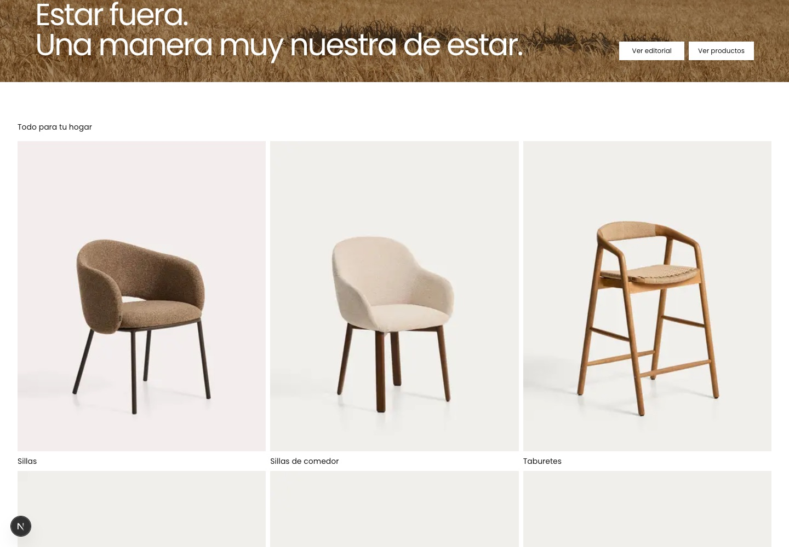
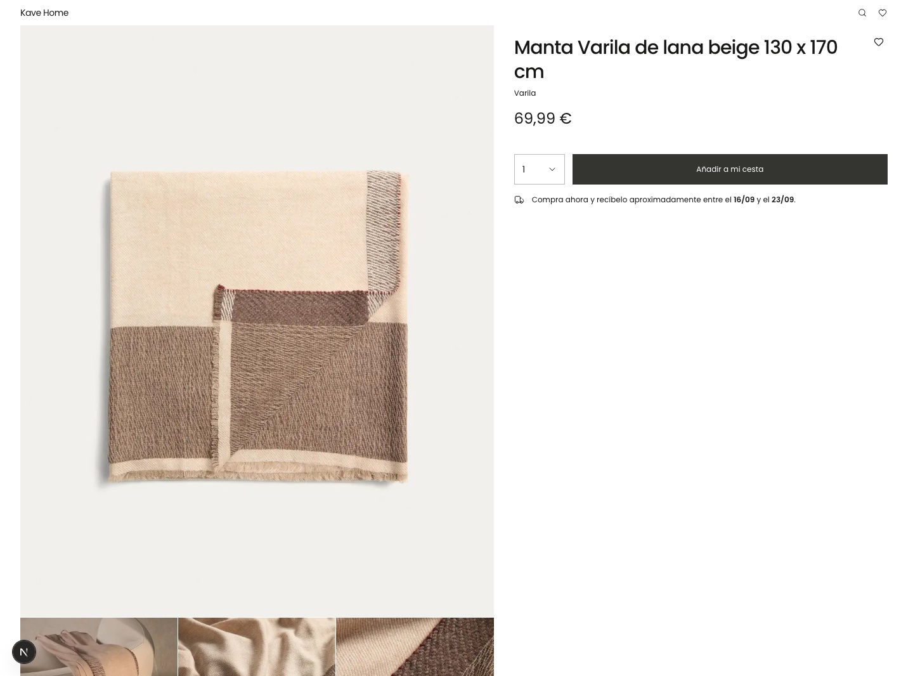

# Kave Home · Frontend Challenge

Storefront responsive construido con Next.js 16, React 19, TypeScript y Tailwind CSS 4. Consume el catálogo público de Kave Home, permite explorar productos y categorías y conserva favoritos en el navegador.

[Ver despliegue en Vercel](https://kave-home-challenge.vercel.app)

## Vista rápida

Las capturas se generaron sobre el modo local determinista incluido en el proyecto.


<table>
  <tr>
    <td width="50%">
      
    </td>
    <td width="50%">
      
    </td>
  </tr>
</table>

## Puesta en marcha

```bash
npm ci
cp .env.example .env.local
npm run dev
```

- `npm run dev`: Next.js con snapshots locales reproducibles.
- `npm run dev:live`: integración directa con la API pública y sus errores reales.
- `npm run build && npm start`: comportamiento de producción, sin fallback oculto a snapshots.

Rutas disponibles: `/`, `/products`, `/products/[sku]`, `/categories`, `/categories/[slug]`, `/favorites` y `/search?q=...`.

## Funcionalidad

- Home editorial con categorías y 20 productos por página.
- Catálogo paginado mediante la URL, con canonical y normalización de páginas inválidas.
- Fichas de categoría con contenido editorial y subcategorías.
- Detalle de producto con galería, precio, disponibilidad y favorito.
- Favoritos con React Context y persistencia versionada en `localStorage`.
- Búsqueda por el endpoint público.
- Estados de carga, vacío, error, recurso inexistente e imagen no disponible.
- Diseño mobile-first, HTML semántico, navegación por teclado y metadata por ruta.

## Arquitectura

El proyecto aplica una arquitectura fractal entendida como **co-localización con promoción por reutilización**, no como una plantilla de carpetas que haya que repetir completa.

```text
src/
  app/            adaptadores finos del App Router
  features/       páginas y UI propias de cada dominio
  containers/     composiciones reutilizadas entre features
  primitives/     piezas mínimas de interfaz
  providers/      estado cliente transversal
  layouts/        composiciones globales
  page-modules/   páginas transversales de error y not-found
  services/       frontera con la API externa
  config/         entorno validado
  constants/      contratos compartidos
  utils/          funciones puras reutilizables
```

Una pieza nace junto a la feature que la necesita. Sólo se promociona al ancestro común más cercano cuando aparece reutilización real:

- Home y Products usan `ProductListing`, por lo que vive en `src/containers/product-listing`.
- Home y las dos superficies de categorías usan `CategoryList`, promovido a `src/containers/category-list`.
- `FavoriteButton` y `FavoritesProvider` son compartidos por varias rutas y viven fuera de una feature concreta.
- `Button`, `Card`, `Input` y `Skeleton` no conocen el dominio y permanecen en `primitives`.

La misma regla se aplica a los estados de carga. Un `loading.tsx` compone el `.Loading` del módulo de página; éste compone loadings de containers, y los containers delegan en sus hijos. Así el esqueleto mantiene la misma estructura que la interfaz final sin duplicar su markup en la ruta.

`app/` sólo conecta convenciones de Next.js con módulos de página. Los Server Components resuelven catálogo y metadata; el JavaScript cliente se reserva para favoritos, búsqueda y carruseles. `catalog-api` concentra transporte, timeout, clasificación de errores y normalización del contrato externo.

## Decisiones técnicas

- **Server-first:** catálogo y metadata se resuelven en servidor; no se expone la integración a componentes cliente.
- **Contrato defensivo:** se validan HTTP, tipo de contenido, JSON, URLs, imágenes y registros antes de llegar a la UI.
- **Paginación por URL:** compartir o recargar una página conserva el estado y produce una canonical estable.
- **Favoritos resilientes:** el esquema de almacenamiento está versionado y tolera datos corruptos, acceso bloqueado y errores de cuota.
- **Sin filtro de categoría ficticio:** el endpoint de productos devuelve los mismos resultados con `category`; las fichas de categoría enlazan al catálogo completo en lugar de aparentar un filtrado inexistente.
- **Dependencia externa visible:** producción no oculta indisponibilidad de la API mediante snapshots automáticos.

## API y desarrollo determinista

La API pública puede responder con HTTP `429`, contenido HTML y la cabecera `x-vercel-mitigated: challenge`. Es un **Vercel Security Checkpoint**, no una cuota ordinaria del API.

CORS es un problema distinto: puede impedir una llamada directa desde el navegador, pero no explica el `429` observado en solicitudes servidor-a-servidor. La aplicación consulta el catálogo desde Next.js, por lo que el bloqueo relevante es el checkpoint externo.

`connection()` evita que las rutas dependientes del catálogo ejecuten esa llamada durante el prerender del build y la desplaza al momento de la petición. Esto permite construir la aplicación, pero no garantiza que la API vaya a aceptar la solicitud en runtime.

Para que el desarrollo y la revisión visual sean reproducibles, `scripts/development.mjs` sirve en loopback snapshots versionados con tres páginas de productos y categorías relacionadas. Este mecanismo sólo se activa con `npm run dev`; `dev:live` y producción mantienen la integración real y hacen visibles sus fallos.

## Proceso de trabajo

1. Consolidación del briefing y validación del contrato real de la API.
2. Construcción incremental de rutas, servicios y estado compartido.
3. Comparación responsive y auditorías de accesibilidad y SEO.
4. Pruebas de errores de red, HTML inesperado, contratos inválidos y almacenamiento.
5. Revisión final del alcance, simplificación de tests y ejecución del quality gate.

## Calidad y tests

```bash
npm run typecheck
npm run lint
npm run lint:styles
npm run format:check
npm test
npm run build
```

`tests/storefront.test.ts` contiene 28 pruebas enfocadas en contratos con riesgo real: paginación, configuración, transporte y normalización de API, metadata, precios, búsqueda y persistencia de favoritos. Se evitaron pruebas de literales editoriales o estructura interna sin comportamiento asociado.

No se añadieron dependencias de testing de componentes ni una suite E2E sólo para aumentar cobertura. Las verificaciones de lector de pantalla, Lighthouse y regresión visual siguen siendo manuales.

## Limitaciones conocidas

- La integración live depende de que el checkpoint externo permita la solicitud servidor-a-servidor.
- No existe listado filtrado por categoría porque `/products/` ignora ese parámetro. Kave Home realiza ese filtrado mediante Algolia, cuyas credenciales de búsqueda no forman parte del contrato entregado.
- Los snapshots locales cubren tres páginas y no sustituyen una integración de producción.
- Carrito y checkout están fuera de alcance; sus controles permanecen deshabilitados.
- La validación en Vercel confirma la limitación: las rutas dependientes del catálogo muestran el estado de error cuando el checkpoint rechaza la solicitud; `/favorites` y las demás superficies estáticas funcionan normalmente.

## Uso de IA

La IA se utilizó como apoyo para explorar el repositorio y el contrato externo, proponer alternativas, implementar, escribir pruebas y ejecutar auditorías sucesivas de código, accesibilidad, SEO y documentación.

Las decisiones documentadas de alcance y arquitectura —server-first, promoción por reutilización, snapshots sólo para desarrollo y ausencia de fallback silencioso— se asumieron explícitamente para esta entrega. Las propuestas generadas con IA se contrastaron con el briefing, el comportamiento observado de la API y el quality gate; la selección y responsabilidad final permanecen en el candidato.
